Modeling longitudinal data
================
John Fee
February 27, 2023

``` r
library(here)
library(dplyr)
library(tidyr)
library(nlme)

library(ggplot2)
library(cowplot)
theme_set(theme_cowplot())

source(here("R","get-data.R"))
data_directory <- here("data")
language <- get_language_data(data_directory)
```

# A random intercept only model

Let’s start by

``` r
null_model <- lme(
  fixed = score ~ 1,
  random = ~1|subject_id,
  data = language
)

summary(null_model)
```

    ## Linear mixed-effects model fit by REML
    ##   Data: language 
    ##      AIC    BIC logLik
    ##   142784 142807 -71389
    ## 
    ## Random effects:
    ##  Formula: ~1 | subject_id
    ##         (Intercept) Residual
    ## StdDev:          15     9.67
    ## 
    ## Fixed effects:  score ~ 1 
    ##             Value Std.Error    DF t-value p-value
    ## (Intercept)   205     0.282 15190     728       0
    ## 
    ## Standardized Within-Group Residuals:
    ##     Min      Q1     Med      Q3     Max 
    ## -4.2473 -0.4892  0.0745  0.5865  3.7036 
    ## 
    ## Number of Observations: 18228
    ## Number of Groups: 3038

``` r
# Estimate the intra-class correlation
rand_eff_var <- VarCorr(null_model)

# Estimate ICC
intercept_sd <- as.numeric(rand_eff_var[1,2])
residual_sd <- as.numeric(rand_eff_var[2,2])

(icc <- intercept_sd / (intercept_sd + residual_sd))
```

    ## [1] 0.609

This indicates that a large proportion (i.e. \~ 61%) of the total
variation is associated with cluster (subject) membership.

``` r
null_fit <- language %>%
  bind_cols(
    null_model$fitted %>% as.data.frame() %>% rename_with(~ glue::glue("fitted_{.}")),
    null_model$residuals %>% as.data.frame() %>% rename_with(~ glue::glue("residuals_{.}"))
  )

# Plot the level 1 fit (grand mean)

null_fit %>%
  ggplot(aes(x = time,y = score,group = time)) +
  geom_violin() +
  geom_jitter(alpha = .1) +
  geom_hline(
    aes(yintercept = fitted_fixed,linetype = "Grand mean estimate"),
    linewidth = 2,
    color = "blue"
    ) +
  scale_x_continuous(breaks = seq(0,5,1)) +
  scale_linetype_manual(name = "",values = c("Grand mean estimate" = "dashed")) +
  labs(
    x = "Observation time",
    y = "Language score",
    title = "Distribution of raw language scores with grand mean estimate"
  ) +
  theme(legend.position = "top")
```

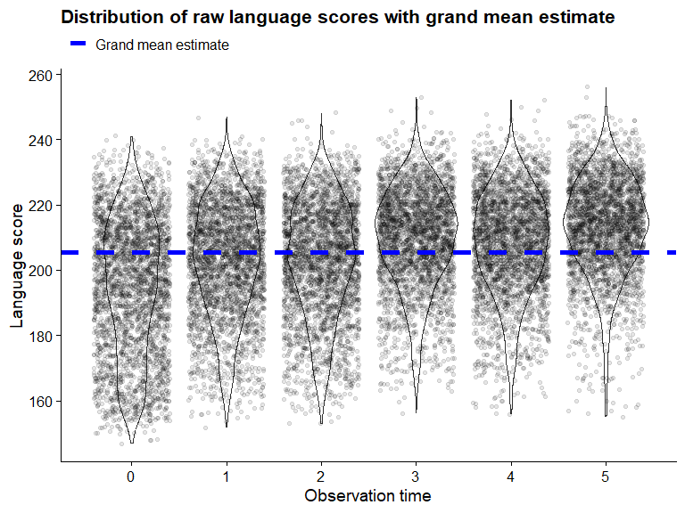<!-- -->

``` r
n_to_subsample <- 10
# Plot a few level 0 fits
null_subset <- null_fit %>%
  distinct(subject_id) %>%
  slice_sample(n = n_to_subsample)

null_subset %>%
  left_join(null_fit,by = "subject_id",multiple = "all") %>%
  mutate(
    subject_id = as.character(subject_id) %>% 
      forcats::fct_reorder(fitted_subject_id,.desc = TRUE)
    ) %>%
  pivot_longer(
    cols = c(score,fitted_subject_id)
  ) %>%
  mutate(
    name = case_when(
      name == "score" ~ "Actual",
      name == "fitted_subject_id" ~ "Predicted"
    )
    #subject_id = factor(subject_id) %>% forcats::fct_reorder(if_else())
  ) %>%
  ggplot(aes(x = time,y = value,color = subject_id)) +
  geom_point() +
  geom_line(aes(group = subject_id)) +
  facet_wrap(vars(name)) +
  scale_color_viridis_d(name = "Subject ID") +
  labs(
    title = "Subject level estimates (varying intercepts)",
    subtitle = glue::glue("Raw data and intercepts for {n_to_subsample} randomly selected subjects shown"),
    x = "Observation time",
    y = "Language score"
  )
```

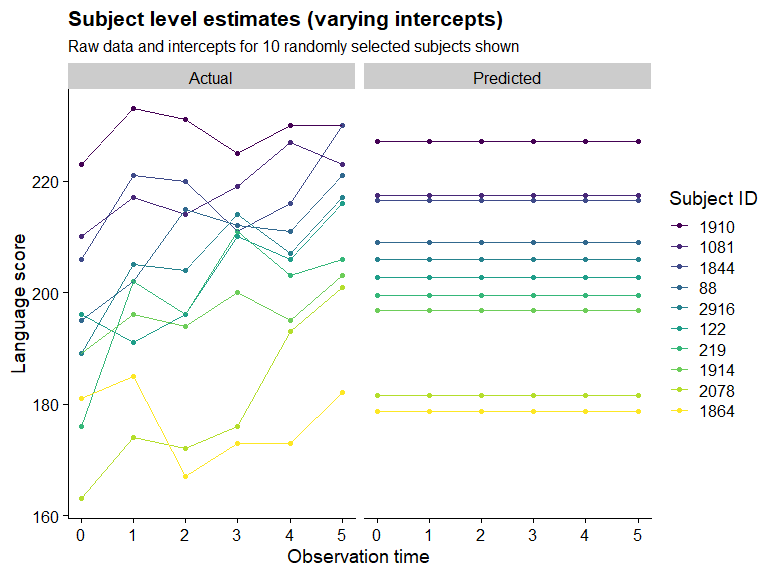<!-- -->

``` r
null_fit %>%
  ggplot(aes(x = fitted_fixed,y = residuals_fixed)) +
  geom_point() +
  geom_smooth(method = "lm",color = "blue")
```

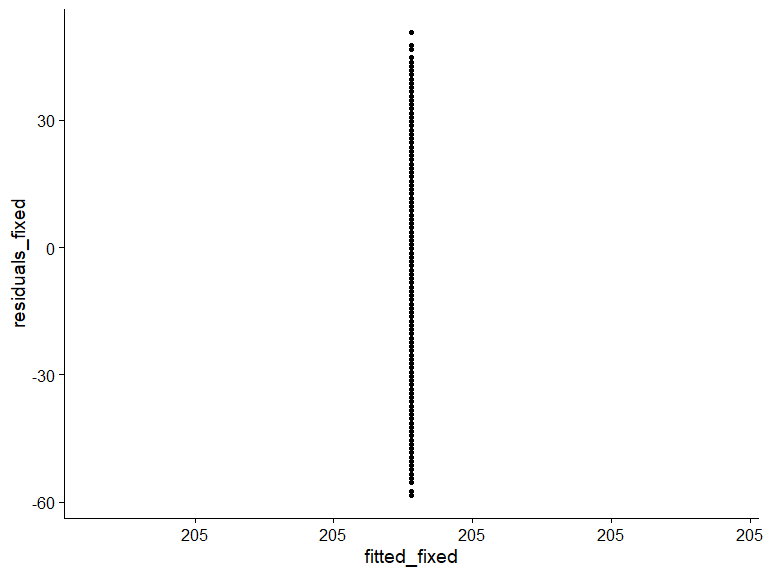<!-- -->

``` r
null_fit %>%
  ggplot(aes(x = fitted_subject_id,y = residuals_subject_id)) +
  geom_point() +
  geom_smooth(method = "lm",color = "blue")
```

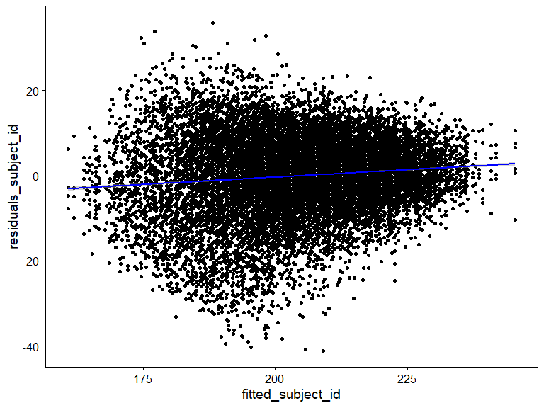<!-- -->

``` r
# Residuals

null_fit %>%
  ggplot(aes(x = time,y = residuals_fixed)) +
  geom_jitter(alpha = .1) + 
  geom_smooth(method = "lm",color = "blue",se = TRUE)
```

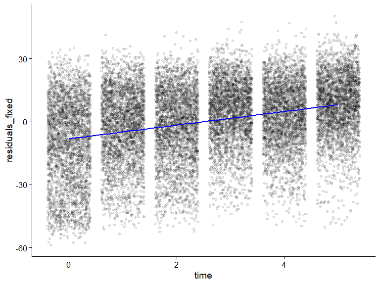<!-- -->

``` r
null_fit %>%
  ggplot(aes(x = time,y = residuals_subject_id)) +
  geom_jitter(alpha = .1) + 
  geom_smooth(method = "lm",color = "blue",se = TRUE)
```

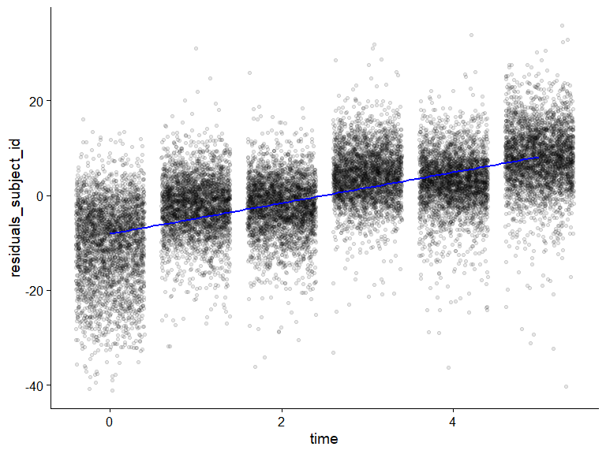<!-- -->

# A random intercept model with a time fixed effect

``` r
model1 <- lme(
  fixed = score ~ time,
  random = ~1|subject_id,
  data = language
)

summary(model1)
```

    ## Linear mixed-effects model fit by REML
    ##   Data: language 
    ##      AIC    BIC logLik
    ##   135174 135205 -67583
    ## 
    ## Random effects:
    ##  Formula: ~1 | subject_id
    ##         (Intercept) Residual
    ## StdDev:        15.2     7.53
    ## 
    ## Fixed effects:  score ~ time 
    ##             Value Std.Error    DF t-value p-value
    ## (Intercept) 197.2    0.2936 15189     672       0
    ## time          3.2    0.0326 15189      99       0
    ##  Correlation: 
    ##      (Intr)
    ## time -0.278
    ## 
    ## Standardized Within-Group Residuals:
    ##     Min      Q1     Med      Q3     Max 
    ## -6.4040 -0.4986  0.0388  0.5669  4.8636 
    ## 
    ## Number of Observations: 18228
    ## Number of Groups: 3038

Does this improve upon the earlier fit (I would certainly hope so)?

``` r
anova(null_model,model1)
```

    ## Warning in anova.lme(null_model, model1): fitted objects with different fixed
    ## effects. REML comparisons are not meaningful.

    ##            Model df    AIC    BIC logLik   Test L.Ratio p-value
    ## null_model     1  3 142784 142807 -71389                       
    ## model1         2  4 135174 135205 -67583 1 vs 2    7612  <.0001

``` r
model1_fit <- language %>%
  bind_cols(
    model1$fitted %>% as.data.frame() %>% rename_with(~ glue::glue("fitted_{.}")),
    model1$residuals %>% as.data.frame() %>% rename_with(~ glue::glue("residuals_{.}"))
  )

# Plot the level 1 fit (grand mean)

model1_fit %>%
  ggplot(aes(x = time,y = score,group = time)) +
  geom_violin() +
  geom_jitter(alpha = .1) +
  geom_line(
    aes(y = fitted_fixed,group = subject_id,linetype = "Grand slope estimate"),
    linewidth = 2,
    color = "blue"
    ) +
  scale_x_continuous(breaks = seq(0,5,1)) +
  scale_linetype_manual(name = "",values = c("Grand slope estimate" = "dashed")) +
  labs(
    x = "Observation time",
    y = "Language score",
    title = "Distribution of raw language scores with grand mean estimate"
  ) +
  theme(legend.position = "top")
```

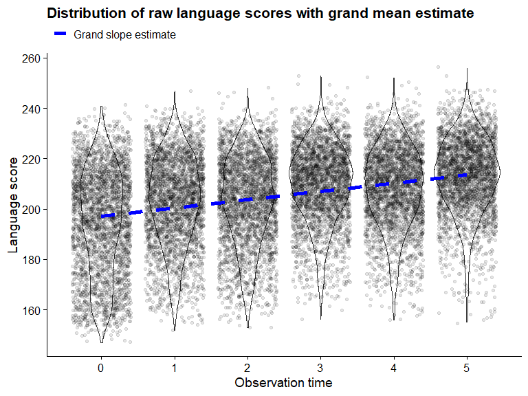<!-- -->

``` r
n_to_subsample <- 10

# Plot a few level 0 fits
model1_subset <- null_fit %>%
  distinct(subject_id) %>%
  slice_sample(n = n_to_subsample)

model1_subset %>%
  left_join(model1_fit,by = "subject_id",multiple = "all") %>%
  mutate(
    subject_id = as.character(subject_id) %>% 
      forcats::fct_reorder(fitted_subject_id,.fun = mean,.desc = TRUE)
    ) %>%
  pivot_longer(
    cols = c(score,fitted_subject_id)
  ) %>%
  mutate(
    name = case_when(
      name == "score" ~ "Actual",
      name == "fitted_subject_id" ~ "Predicted"
    )
    #subject_id = factor(subject_id) %>% forcats::fct_reorder(if_else())
  ) %>%
  ggplot(aes(x = time,y = value,color = subject_id)) +
  geom_point() +
  geom_line(aes(group = subject_id)) +
  facet_wrap(vars(name)) +
  scale_color_viridis_d(name = "Subject ID") +
  labs(
    title = "Subject level estimates (varying intercepts)",
    subtitle = glue::glue("Raw data and intercepts for {n_to_subsample} randomly selected subjects shown"),
    x = "Observation time",
    y = "Language score"
  )
```

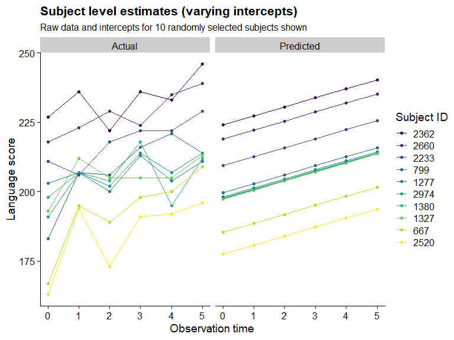<!-- -->

``` r
model1_subset %>%
  left_join(model1_fit,by = "subject_id",multiple = "all") %>%
  mutate(
    subject_id = as.character(subject_id) %>% 
      forcats::fct_reorder(fitted_subject_id,.fun = mean,.desc = TRUE)
    ) %>%
  pivot_longer(
    cols = c(score,fitted_subject_id)
  ) %>%
  mutate(
    name = case_when(
      name == "score" ~ "Actual",
      name == "fitted_subject_id" ~ "Predicted"
    )
    #subject_id = factor(subject_id) %>% forcats::fct_reorder(if_else())
  ) %>%
  mutate(
    uniq_id = glue::glue("{subject_id}_{name}")
  ) %>%
  ggplot(aes(x = time,color = name,shape = name,linetype = name)) +
  geom_point(aes(y = value)) +
  geom_line(aes(
    y = value,
    group = uniq_id
    )) +
  facet_wrap(vars(subject_id)) +
  scale_color_manual(
    values = c("Actual" = "black","Predicted" = "red")
    ) +
  scale_shape_manual(values = c("Actual" = 1,"Predicted" = NA)) +
  scale_linetype_manual(values = c("Actual" = NA,"Predicted" = "solid")) +
  labs(
    title = "Subject level estimates (varying intercepts and shared slope)",
    subtitle = glue::glue("Raw data and intercepts for {n_to_subsample} randomly selected subjects shown"),
    x = "Observation time",
    y = "Language score",
    color = "",
    shape = "",
    linetype = ""
  ) +
  theme(legend.position = "top")
```

    ## Warning: Removed 60 rows containing missing values (`geom_point()`).

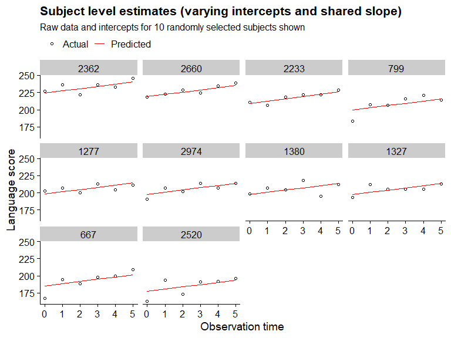<!-- -->

``` r
model1_fit %>%
  ggplot(aes(x = fitted_subject_id,y = residuals_subject_id)) +
  geom_point() +
  geom_smooth(method = "lm",color = "blue")
```

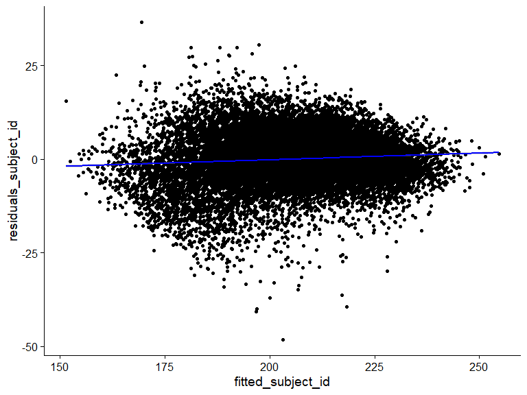<!-- -->

``` r
# Residuals

model1_fit %>%
  ggplot(aes(x = time,y = residuals_fixed)) +
  geom_jitter(alpha = .1) + 
  geom_smooth(method = "lm",color = "blue",se = TRUE)
```

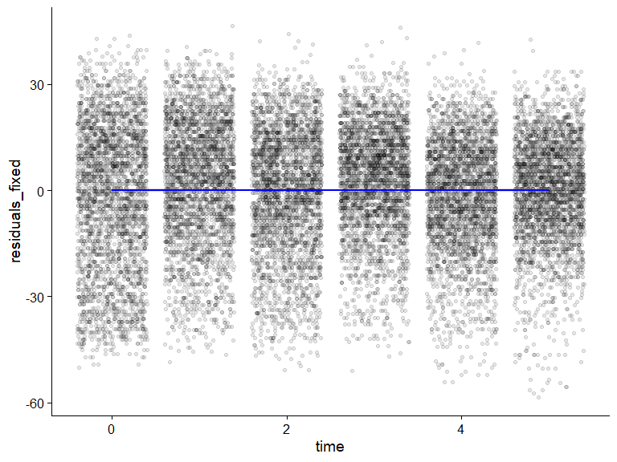<!-- -->

``` r
model1_fit %>%
  ggplot(aes(x = time,y = residuals_subject_id)) +
  geom_jitter(alpha = .1) + 
  geom_smooth(method = "lm",color = "blue",se = TRUE)
```

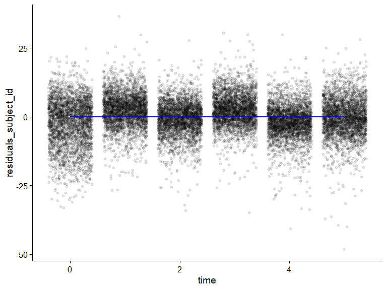<!-- -->
